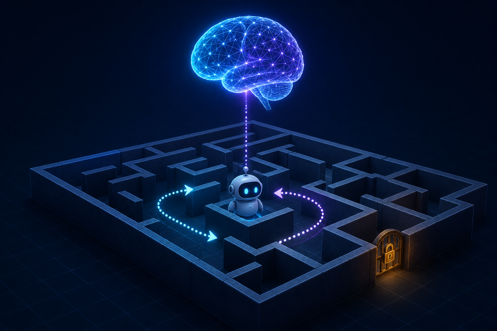

# Conversation-History Maze Agent



## Purpose

Build an embodied maze agent in which an LLM reasons about what to do, but
cannot see or alter the world directly. The agent's body is the only path
between the LLM and the maze environment.

The maze is not merely a setting. It is the authoritative world: it limits
what actions are possible, applies the rules, and determines the outcome of
every attempted action.

## Entities and responsibilities

### LLM — the brain

The LLM has a mediated conversation with the environment through the agent
body. It receives verified environment results from prior requests, then
chooses the next environment interaction to request.

The LLM must not:

- read hidden maze state;
- modify the maze directly;
- execute an action itself; or
- assume that a requested action succeeded.

For example, it may request `move north`, but it does not decide whether the
move was possible.

### Agent — the body and control loop

The agent is the LLM's embodied interface. It owns the control loop and is
responsible for:

- accepting only interaction requests described by the environment interface;
- sending a valid request to the environment;
- returning the environment's verified result to the LLM; and
- maintaining the conversation history for the current run.

The agent does not invent observations or outcomes, bypass environment rules,
or turn an LLM action request into a successful action.

### Environment — the maze

The environment owns all true world state and rules, including maze layout,
walls, the robot's position, items, exits, action validity, and action
outcomes. It exposes a limited interface through which the agent body can
interact with it.

The environment does not depend on the LLM's private reasoning and does not
trust it to report state correctly.

## Interaction model

```text
LLM → interaction request → Agent/body → environment call → Environment
Environment → verified result → Agent/body → conversation history → LLM
```

The LLM chooses one of two interaction types on each turn:

- An `observe` action asks what the body can currently perceive. Its result is
  an observation from the environment.
- A world-changing action, such as `move`, asks the environment to attempt a
  permitted state change. Its result reports the verified outcome.

The agent sends the selected interaction to the environment. The environment
validates it, changes state only when allowed, and returns the verified result.
The agent appends that request and result to conversation history before the
LLM reasons again.

If the LLM requests `move north` and a wall blocks the route, the environment
returns a blocked result. The agent relays that result; the LLM must revise its
understanding and choose again.

The agent body does not decide when to observe. Observation is an action the
LLM may request, just like any other environment interaction.

## Environment interface

The environment interface is the agent body's contract. It defines every
interaction the agent can attempt. The final set of maze actions will be
specified by the environment, but includes an `observe` action and might
include `move`, `takeKey`, `unlockExit`, and `exit`.

No component may perform an action outside this interface.

## Core invariants

- The environment is the sole authority for world state and action outcomes.
- The LLM can request actions but cannot execute them directly.
- The agent body is the only interaction boundary between the LLM and the
  environment.
- Conversation history contains only the LLM's interaction requests and the
  corresponding environment-verified observations or results.
- Hidden maze state is never added to the LLM's context.
